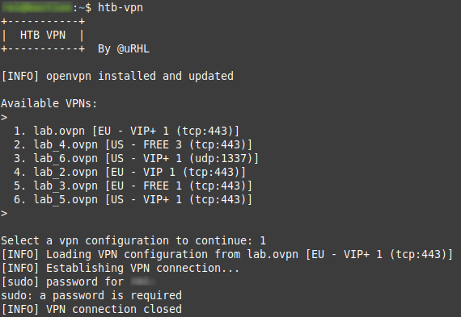

# HTB-VPN agent &ensp;<a title="vpn icons" href="https://www.flaticon.es/icono-gratis/vpn_3264847?term=vpn&page=1&position=4&page=1&position=4&related_id=3264847&origin=search"></a>
 
Keep your VPNs for [Hack The Box (HTB)](https://www.hackthebox.com/) organized and *ready-to-hand* with `htb-vpn` tool.



## Features

- **HTB VPN management**. Select the VPN profile you want to use for each hacking session

- **Auto-updates**. Check for updates for `openvpn` client and install them automatically

## Download

First of all you need to download the files. There are two options: clonning the repo or downloading the a release.

### Cloning the repo

```shell
cd your-desired-installation-dir
git clone https://github.com/uRHL-tools/htb-vpn.git
```

### Release download

Download the [latest release](https://github.com/uRHL-tools/htb-vpn/releases). To extract the contents of the file, depending on the compression algorithm, execute
```
unzip release.zip -d your-installation_dir/
```
or
```
tar -zxvf release.tar.gz
```

## Installation

Open a new terminal and type:

```shell
cd your-installtion-dir
chmod +x htb_vpn.py
sudo ln -s htb_vpn.py /usr/local/bin/htb-vpn
```

## Usage

> Note: Python3 is required

Once you have completed the installation, you can run `htb-vpn` by simply typing in your terminal

``` shell
htb-vpn
```

## Select your VPN

If it is the first time you are using HTB, check out their tutorial: [Introduction to lab access](https://help.hackthebox.com/en/articles/5185687-introduction-to-lab-access). They will tell you how to select and download the VPN configuration file from your HTB profile page.

Once you have downloaded your VPN configuration file, save it in the directory `~/htb-vpn/conn`.

## License

<a rel="license" href="http://creativecommons.org/licenses/by-sa/4.0/"></a><br />This work is licensed under a <a rel="license" href="http://creativecommons.org/licenses/by-sa/4.0/">Creative Commons Attribution-ShareAlike 4.0 International License</a>.
